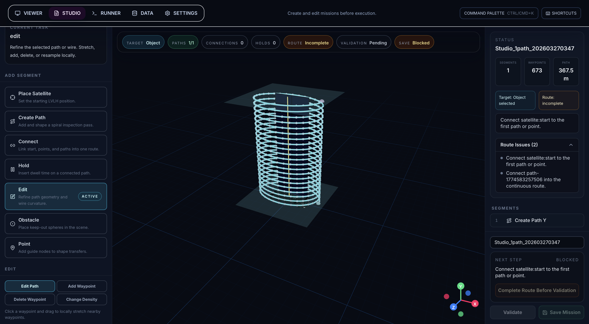
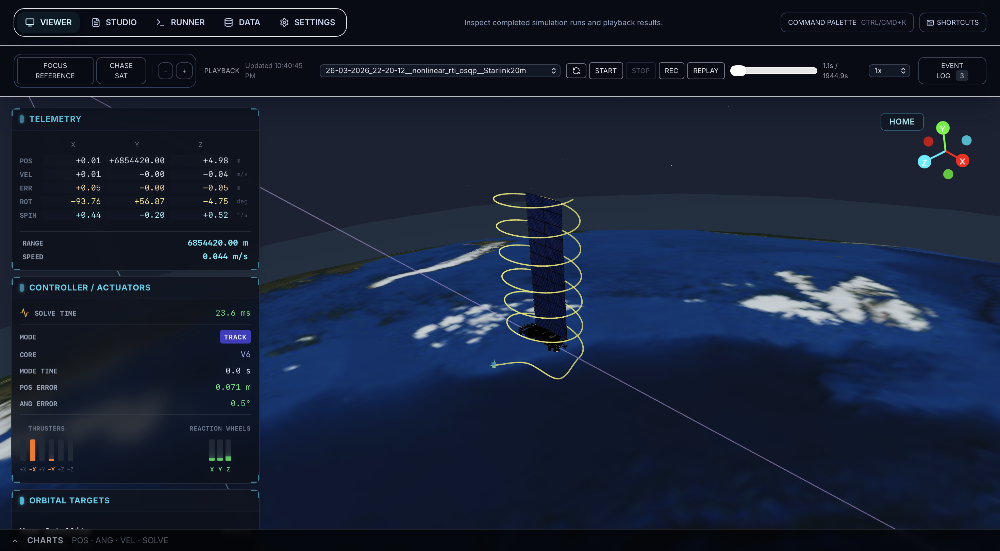

# Orbital Inspector Satellite Control

3D inspection-satellite software for designing, simulating, and evaluating autonomous inspection missions around stationary space objects.

This project continues the same inspection-satellite idea as my master's project on a planar 2D testbed, but moves the problem into full 3D. Instead of authoring paths on a flat floor, the software stack now supports mission design around orbital targets, simulation playback, telemetry, controller comparisons, and sweep-based MPC tuning.

The current showcase mission uses a Starlink satellite model as the inspection target. The repo is simulation-first and intended as a public research/demo project rather than as flight software.

## Showcase

Overview of the Mission Studio workspace and authoring tools:



Overview of the Viewer workspace and mission playback controls:



## What This Repo Is

- A local-first mission control and simulation stack for 3D orbital inspection scenarios
- A browser-based Mission Studio for authoring paths, connections, holds, and target-relative inspection geometry
- A controller benchmarking environment for comparing multiple MPC profiles against the same mission
- A telemetry and playback workflow for inspecting solve time, trajectory quality, and actuator behavior
- A research/demo codebase for experimenting with inspection autonomy around stationary orbital targets

## What This Repo Is Not

- Not flight software
- Not a packaged end-user product
- Not a guarantee that every controller profile works out of the box on every machine
- Not a one-command acados setup; the acados-backed profiles require additional native prerequisites

## Quick Start

### Requirements

- Python 3.11
- Node.js 20+
- CMake + Ninja for the C++ extension builds
- Network access for the first `make install` so `acados_template` can be fetched from the `acados` source repo

### Recommended first run

```bash
make install
make ui-build
make run-app
```

Open `http://127.0.0.1:8000`.

### Useful commands

```bash
make run          # backend + frontend dev servers
make run-app      # backend serving prebuilt ui/dist
make sim          # interactive CLI simulation run
make sweep        # 10x10 dt/horizon MPC sweep with saved winners
make test         # backend pytest suite
make lint         # backend + frontend + docs checks
```

### acados profiles

The OSQP-based profiles are the easiest path for a fresh clone. If you want to use the acados-backed RTI/SQP profiles, you also need:

- compiled acados C libraries available locally
- `ACADOS_SOURCE_DIR` set at runtime

## Project Highlights

### Mission Studio

The UI includes a Mission Studio for constructing inspection routes around a target object. You can place the inspector, create spiral paths, connect path segments, add holds, and validate the route before execution.

### Simulation and Playback

The backend runs the mission through the satellite dynamics and controller stack, writes simulation artifacts under `data/simulation_data/`, and serves playback data back into the viewer for inspection.

### MPC Controller Comparisons

The repo supports six canonical MPC controller profiles:

- Hybrid RTI + OSQP
- Nonlinear RTI + OSQP
- Linearized RTI + OSQP
- Full nonlinear MPC + IPOPT
- Nonlinear RTI + HPIPM
- Nonlinear SQP + HPIPM

Comparison and fairness workflows are documented in the math notes and benchmark scripts.

### Sweep-Based Tuning

`make sweep` runs a 10x10 grid over controller interval and horizon length, records results for each controller, writes comparison artifacts, and persists the best profile-specific setup when an eligible winner exists.

## Public Demo Caveat

This repository is set up for reproducible local experimentation, but the public demo story is intentionally narrower than the total internal development surface:

- the Starlink mission is a showcase scenario
- the current public framing is inspection of stationary objects
- the repo mixes simulation, controller research, UI tooling, and packaging support

Future work is aimed at extending the inspection problem from stationary targets to moving spacecraft in Earth orbit, where the inspector first has to catch up to the object before carrying out the inspection route.

## Repository Layout

- `controller/` backend package, simulation runtime, controller implementations, and config models
- `ui/` frontend application and Mission Studio
- `missions/` sample mission payloads including `Starlink-FullScan.json`
- `scripts/` benchmark, packaging, and operational helpers
- `data/assets/model_files/` canonical 3D assets used by the UI and simulation
- `tests/` backend tests
- `MATH/` controller mathematics and comparison notes

## Additional Docs

- [ARCHITECTURE.md](ARCHITECTURE.md)
- [PHYSICS-ENGINE.md](PHYSICS-ENGINE.md)
- [MATH/README.md](MATH/README.md)
- [docs/github-launch-checklist.md](docs/github-launch-checklist.md)

## Contributing & Policies

- [CONTRIBUTING.md](CONTRIBUTING.md)
- [CODE_OF_CONDUCT.md](CODE_OF_CONDUCT.md)
- [SECURITY.md](SECURITY.md)
