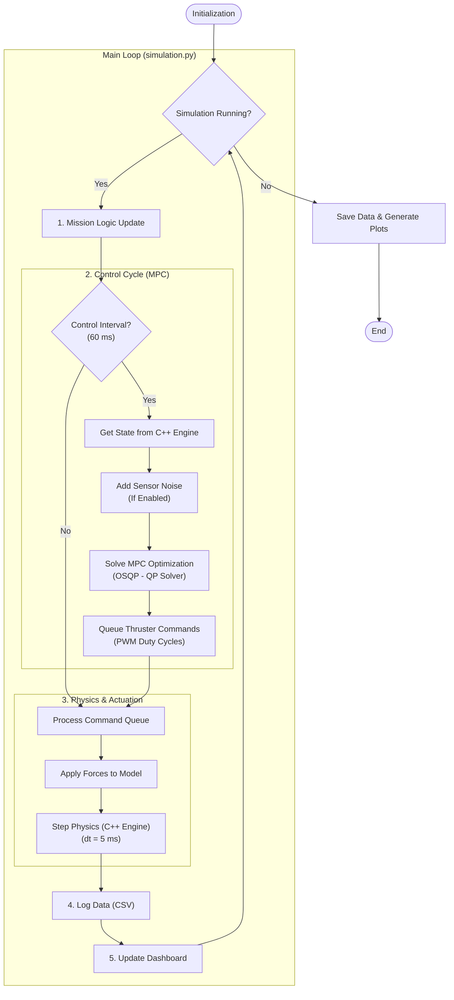

# Simulation Guide

Complete guide to running the path-based unified mission simulation and the
simulation loop architecture.

---

## Table of Contents

- [Overview](#overview)
- [Mission Flow](#mission-flow)
- [Simulation Loop Architecture](#simulation-loop-architecture)
- [Timing & Frequency](#timing--frequency)
- [Mission Configuration](#mission-configuration)
- [Performance Characteristics](#performance-characteristics)
- [Running Simulations](#running-simulations)
- [Troubleshooting](#troubleshooting)

## Overview

The active runtime is **path-based MPC only** using unified mission v2 JSON
files. Missions are authored in the web UI, saved to `missions_unified/`, then
run from the terminal (`make sim` or `python run_simulation.py run --mission ...`).
The simulation uses a high-fidelity custom C++ physics engine with MPC running
at different rates for optimal performance.

**Quick Start:**

```bash
make sim
# Or
python run_simulation.py run --auto
```

---

## Mission Flow

**Follow a saved 3D unified mission path using the path-based MPC controller**

**How missions are defined and run:**

1. Build mission path/segments in the web UI
2. Save unified mission v2 JSON to `missions_unified/`
3. Run in terminal and choose from saved mission files

**Runtime phases:**

1. **POSITIONING** - Move to nearest point on the mission path
2. **PATH_STABILIZATION** - Stabilize before tracking
3. **TRACKING** - Follow the mission path reference
4. **STABILIZING** - Stabilize at mission end
5. **RETURNING** (optional) - Return to configured return pose

---

## Simulation Loop Architecture

**Key File:** `src/satellite_control/core/simulation.py`

### High-Level Control Flow



### Component Interactions

**1. Path Reference** (`mission_state.py` + `mpc_controller.py`)

MPCC derives the reference state from the configured path:

**Inputs:**

- `mission_state.path_waypoints` - Path waypoints
- Path progress state `s` and virtual speed `v_s`

**Outputs:**

- `target_state` - Reference state aligned to path tangent
- `path_s` / `path_v_s` - Progress metrics used for logging/visualization

**2. Control Cycle (MPC)**

Runs at **16.67 Hz** (every 60ms):

**Input:**

- Current state (position, attitude quaternion, linear/angular velocity)
- Path progress state (`s`) and path reference at the projected point

**Computation:**

- Formulates Quadratic Program (QP) with:
  - Prediction horizon from `app_config.mpc.prediction_horizon`
  - MPCC augmented state (includes path progress `s`)
  - Controls: 3 reaction-wheel torques + configured face thrusters + virtual progress control
  - Cost function: minimize contour/lag/path-speed tracking error + control effort
- Solves using **OSQP** (typical: 1-2ms)

**Output:**

- Thruster duty cycles for configured thruster count (default cube layout: 6)
- Reaction wheel torque commands for 3 axes
- Only first control action applied (receding horizon)

**3. Physics & Actuation** (`cpp_satellite.py`)

Runs at **200 Hz** (every 5ms):

**Process:**

1. **Thruster Manager** - Simulates valve delays and ramp-up (if enabled)
2. **Force Calculation** - Converts PWM to force vectors
3. **Frame Transform** - Rotates body-frame forces to world frame
4. **Apply to Physics Engine** - Applies forces/torques for the next step

**Physics Integration:**

- Computes accelerations from forces (F = ma, τ = Iα)
- Integrates to update velocities
- Integrates to update positions
- Enforces constraints (position/velocity bounds, solver limits)

**4. Data Logging** (`data_logger.py`)

**Logged Every Physics Step (200 Hz):**

- State: position, velocity, orientation
- Targets: current target state
- Mission phase

**Logged Every Control Step (16.67 Hz):**

- Thruster commands (8 duty cycles)
- MPC solve time
- MPC cost function value
- Solver status

**Output Files:**

- `physics_data.csv` - High-rate state history
- `control_data.csv` - Control inputs and MPC metrics

---

## Timing & Frequency

The simulation uses a **two-rate loop structure** for optimal performance:

### Control Loop: 16.67 Hz (60 ms period)

- **Purpose:** MPC optimization and control decisions
- **What happens:**
  - Read current state from physics engine
  - Solve QP optimization
  - Output thruster commands

### Physics Loop: 200 Hz (5 ms period)

- **Purpose:** High-fidelity dynamics integration
- **What happens:**
  - Apply thruster forces
  - Integrate equations of motion (C++ engine)
  - Update positions, velocities, orientations

### Why Two Rates?

```
Physics: |-----|-----|-----|-----|-----|-----|-----|-----|-----|-----|-----|-----| (200 Hz)
Control: |---------------------------|---------------------------| (16.67 Hz)
         ^                           ^
         MPC solve here             MPC solve here

Between MPC solves, physics continues with previous commands
```

**Benefits:**

- Physics captures fast dynamics
- Control has time to solve optimization
- Realistic representation of digital control systems

**Key Insight:** Physics runs 12 times between each MPC solve (60ms / 5ms = 12).

### Timing Configuration

All timing parameters in `src/satellite_control/config/timing.py`:

```python
CONTROL_DT = 0.06      # 16.67 Hz control loop
SIMULATION_DT = 0.005  # 200 Hz physics integration
```

**Recommendation:** Keep physics rate ≥10× control rate for stability.

---

## Mission Configuration

### Command-Line Options

Quick launch without interactive menu:

```bash
# Auto mode with defaults
python run_simulation.py run --auto

# Custom duration
python run_simulation.py run --duration 30.0

# Headless mode (no animation)
python run_simulation.py run --no-anim

```

### Timing Parameters

**Waypoint Mission:**

- Position tolerance: 0.05m (convergence criterion)
- Velocity tolerance: 0.05 m/s (stabilization criterion)
- Angle tolerance: 3° (orientation accuracy)
- Waypoint hold time: Configurable

**Path Following Mission:**

- Positioning phase: Approach nearest point
- Tracking phase: Variable (path_length / target_speed)
- Stabilization time: Configurable (default 10-15s)
- Return phase: Optional, variable duration

All constants modifiable in `src/satellite_control/config/timing.py`.

### Mission Safety & Constraints

**Workspace Limits:**

- Position bounds: ±3.0 meters from origin
- Max velocity: 0.5 m/s (enforced by MPC)
- Max angular velocity: π/2 rad/s ≈ 1.57 rad/s
- Simulation boundary: 6×6 meter virtual workspace

**MPC Safety Features:**

- Soft constraints on position (can violate with penalty)
- Hard constraints on velocity and angular velocity
- Automatic trajectory correction if approaching bounds
- Mission abort if constraints violated repeatedly

---

## Performance Characteristics

### Computational Load

| Component        | Frequency | Duration | % of Control Period |
| ---------------- | --------- | -------- | ------------------- |
| MPC Solve        | 16.67 Hz  | 1-2ms    | 2-3%                |
| Physics Step     | 200 Hz    | ~0.05ms  | <1%                 |
| Logging          | 200 Hz    | ~0.01ms  | <1%                 |
| Dashboard Update | 10 Hz     | ~5ms     | minimal (async)     |

**Total:** Simulation runs **faster than real-time** on modern hardware.

### Bottlenecks

1. **MPC Solver** - Dominates computation
   - Scales with horizon length (N=50)
   - Typical: 1-2ms with OSQP
2. **Visualization** - Headless or dashboard visualization
   - Rendering can slow to real-time
   - Disable with `--no-anim` for max speed

### Expected Performance

| Metric             | Target | Acceptable | Poor  |
| ------------------ | ------ | ---------- | ----- |
| MPC solve time     | <2ms   | <5ms       | >10ms |
| Position error     | <0.02m | <0.05m     | >0.1m |
| Angle error        | <2°    | <5°        | >10°  |
| Settling time (1m) | <15s   | <30s       | >45s  |

---

## Running Simulations

### Interactive Mode (Default)

```bash
python run_simulation.py run
```

**Workflow:**

1. Launch the simulation from terminal
2. Choose a saved mission file
3. Confirm run parameters
4. Execute simulation
5. Review generated plots and animation

### Execution Flow Example

```
t=0.000s: MPC Solve
  ├─ Read state: x=0.0, y=0.0, θ=0.0
  ├─ Target: x=1.0, y=0.0, θ=0.0
  ├─ Solve QP in 1.2ms
  └─ Output: u = [0.0, 0.0, 0.0, 0.0, 0.82, 0.76, 0.0, 0.0]

t=0.005s - t=0.055s: Physics Steps (12 steps)

t=0.060s: MPC Solve (new state after 12 physics steps)
  ├─ Read state: x=0.012, y=0.0, θ=0.002
  ├─ Solve QP in 1.3ms
  └─ Output: u = [0.0, 0.0, 0.0, 0.0, 0.79, 0.74, 0.0, 0.0]
```

### Output Location

```
Data/
└── Simulation/
  └── DD-MM-YYYY_HH-MM-SS/
    ├── physics_data.csv
    ├── control_data.csv
    └── Simulation_3D_Render.mp4
```

---

## Troubleshooting

### Simulation Running Slower Than Real-Time

**Check:**

1. MPC solve times in `control_data.csv`
2. Disable visualization: `python run_simulation.py run --no-anim`
3. Reduce horizon: Set `MPC_PREDICTION_HORIZON = 30`

### Physics Instability

**Symptoms:** Satellite position jumps, non-physical behavior

**Solutions:**

1. Reduce physics timestep: `SIMULATION_DT = 0.002` (500 Hz)
2. Check solver warnings in console
3. Verify forces are reasonable magnitude (<10N)

### Control Oscillations

**Symptoms:** Satellite oscillates around target

**Solutions:**

1. Increase velocity cost: `Q_VELOCITY = 15000`
2. Reduce control effort weight: `R_THRUST = 0.5`
3. Check MPC solve status for failures

### Configuration

Change loop rates in `src/satellite_control/config/timing.py`:

```python
CONTROL_DT = 0.06      # Control frequency
SIMULATION_DT = 0.005  # Physics frequency
```

---

## Summary

The simulation provides:

✅ **Accurate physics** with high-rate (200 Hz) integration  
✅ **Realistic control** with discrete-time (16.67 Hz) MPC  
✅ **Efficient computation** by separating control and physics rates  
✅ **Comprehensive logging** for post-analysis  
✅ **Real-time visualization** via terminal dashboard  
✅ **Path-based missions** created in web UI and executed in terminal

This design mirrors real embedded control systems where controllers run at lower rates than sensor/actuator updates.

**Next Steps:**

-- See [README.md](../README.md) for getting started
- See [TESTING.md](TESTING.md) for validation and testing
- See [VISUALIZATION.md](VISUALIZATION.md) for understanding output
